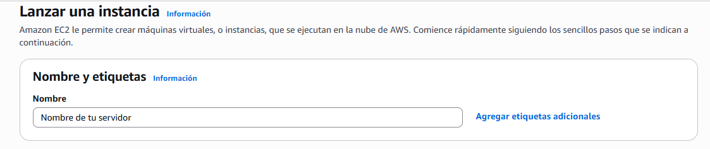
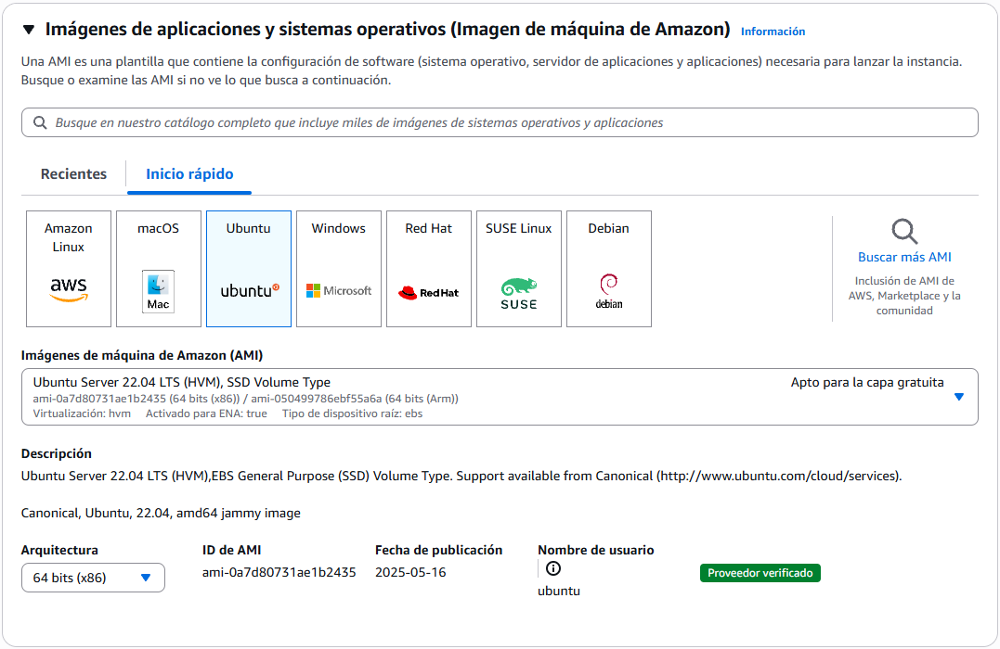
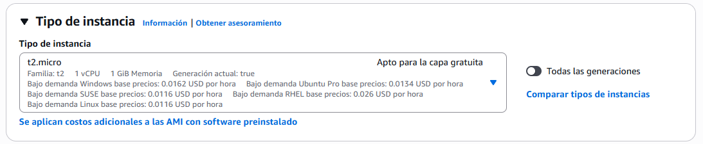
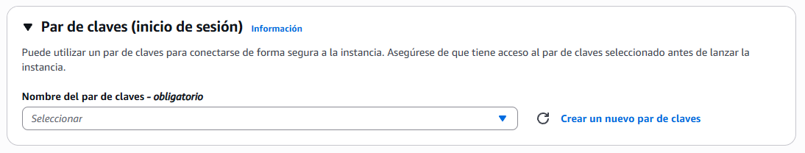
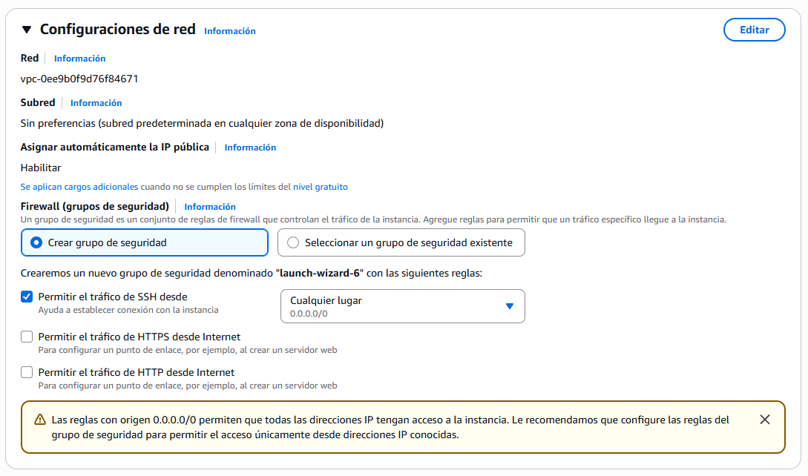
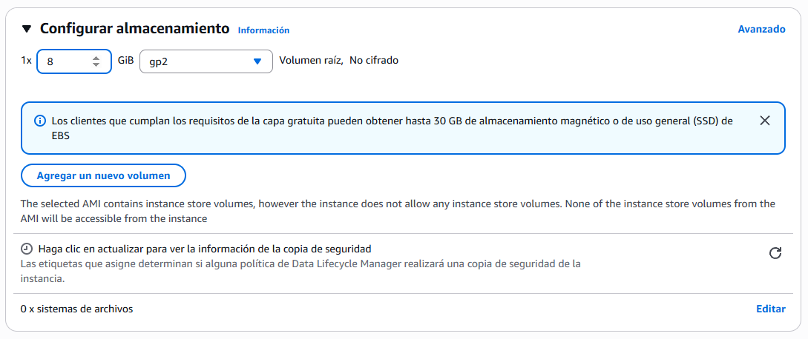

[](https://classroom.github.com/open-in-codespaces?assignment_repo_id=19666495)
# Despliegue de una aplicación Django en EC2☁️

## 📜 Introducción
Esta es una guía para diseñada para aprender a levantar una aplicación Django usando Docker, ejecutarla de forma local con SQLite y poder desplegarla en una instancia EC2 (Ubuntu 22.04).

## 👨‍💻 Reconocimiento
Proyecto basado en el repositorio de:
[https://github.com/wdavilav/pos-store](https://github.com/wdavilav/pos-store)

Repositorio de apoyo: [https://github.com/patobalboa/pos-store-django](https://github.com/patobalboa/pos-store-django)


# Creación de la instancia
A continuación se mostrará un paso a paso de la creacion de una instancia:
### Paso 1: Asignar un nombre a la instancia.


### Paso 2: Seleccionar imagen y sistema operativo.
Se selecciona el sistema operativo Ubuntu con una versión de imagen Ubuntu Server 22.04.



### Paso 3: Seleccionar tipo de instancia.
El tipo de instancia elegído es t2.micro.


### Paso 4: Crear o Usar par de claves existentes.


### Paso 5: Configuración de redes
En este apartado no modificamos nada


### paso 6: Configurar almacenamiento (No se si esta bueno)
Usamos esta configuración de almacenamiento.


## Finalmente se lanza la instancia en AWS.

## Entrar al PuTTY
Pasos para entrar al putty

### 🚨 Nota 
La instancia debe estar creada previamente y el programa PuTTY ya abierto.

## 🚧 Proceso de creación 

### 1) Entrar en usuario root
```bash
sudo su -
```

### 2) Actualiza apt
```bash
apt update
```

### 3) Instalación de weasyprint
```bash
sudo apt install weasyprint
```

### 4) Verifica versión instalada de python
```bash
python3 --version
```
En caso de no tener python instalado
```bash
apt install python3 python3-pip python3-venv git -y
```

### 5) Crea una carpeta
```bash
mkdir Tucarpeta
cd Tucarpeta
```

### 6) Clonamos el repositorio
```bash
git clone https://github.com/wdavilav/pos-store.git .
```

### 7) Ejecutamos Python3
```bash
python3 -m venv env
```

### 8) Utilizamos esta fuente
```bash
source env/bin/activate
```

### 9) Instalamos estos recursos
```bash
pip install -r deploy/txt/requirements.txt
```

## 📋 Pasos para la instalación

### 1) Crear entorno virtual
Para Windows
```bash
python3 -m venv env
```
Para Linux
```bash
virtualenv venv -ppython3
```

### 2) Activar entorno virtual
Para Windows
```bash
cd venv\Scripts\activate.bat
```
Para Linux
```bash
source env/bin/activate
```

### 3) Instalar librerias de la carpeta deploy
```bash
pip install -r deploy/txt/requirements.txt
```

### 4) Crear las tablas de las bases de datos de las migraciones de django
```bash
python manage.py makemigrations
python manage.py migrate
```

### 5) Insertar datos iniciales en las entidades de los módulos de seguridad y usuario del sistema
```bash
python manage.py shell --command='from core.init import *'
```

### 6) Insertar datos iniciales de categorías, productos, clientes y ventas aleatorias (Paso opcional)
```bash
python manage.py shell --command='from core.utils import *'
```

### 7) Iniciar servidor
```bash
python manage.py runserver 0.0.0.0:8080
```

### 8) Iniciar sesión en el sistema
```bash
username: admin
password: hacker94
```

# Creación de base de datos en AWS

```bash
FOTOS DE CREACION DE BASE DE DATOS (FALTA)
```

# Conectar Base de datos RDS PostgreSQL a proyecto POS-VENTA Django

### 🚨 Nota
La Base de datos RDS PostgreSQL debe estar creada previamente y el programa PuTTY ya abierto.

### 1) Nos vamos a la carpeta donde clonamos nuestro proyecto
```bash
cd /ruta/del/proyecto
```

### 2) Activamos entorno virtual
```bash
source env/bin/activate
```

### 3) Instalamos driver de postgreSQL
```bash
pip install psycopg2-binary
```

### 4) Guardamos datos SQLite (BD predeterminada de Django) en un formato JSON
```bash
python manage.py dumpdata > data.json
```

### 5) Vamos a settings.py
```bash
cd config/
nano settings.py
```

### 6) Vamos a settings.py
```bash
DATABASES = {
    'default': {
        'ENGINE': 'django.db.backends.postgresql_psycopg2',
        'NAME': 'NOMBRE BASE DE DATOS',
        'USER': 'NOMBRE USUARIO',
        'PASSWORD': 'CONTRASEÑA',
        'HOST': 'HOST BASE DE DATOS',
        'PORT': '5432',
    }
}

```
### 7) Instalamos cliente de PostgreSQL para ingresar a su consola
```bash
sudo apt install postgresql-client
```

### 8) Nos metemos a la base de datos predeterminada de PostgreSQL en RDS
```bash
psql -h HOST BASE DE DATOS -p 5432 -U USUARIO -d postgres - w
```

### 9) Revisamos bases de datos existentes en nuestra RDS
```bash
\l
```

### 10) Deberian salir estas bases de datos.
```bash
- postgress
- rdsadin
- template0
- template1
```

### 11) Creamos nuetra base de datos (BD que creamos en AWS)
```bash
CREATE DATABASE "NOMBRE BASE DE DATOS" WITH OWNER USUARIO BASE DE DATOS;
```

### 12) Nos salimos
```bash
\q
```

### 13) Cargamos ahora la data.json que contiene los datos de SQLite, con esto los cargamos 
```bash
python manage.py loaddata data.json
```

### 13) Migramos y deberia estar todo bien!
```bash
python manage.py migrate
```

# Integracion de Balanceador de carga y Auto Scaling

## PASO 1:

# Crear archivo de servicio systemd en PUTTY 
```bash
sudo nano /etc/systemd/system/django-pos.service
```

# Pegar esto
```bash
[Unit]
Description=Django POS App Service
After=network.target

[Service]
User=root
WorkingDirectory=/root/webdjango
ExecStart=/root/webdjango/env/bin/python /root/webdjango/manage.py runserver 0.0.0.0:8080
Restart=always

[Install]
WantedBy=multi-user.target

```

# Recargar systemd y habilitar el servicio
```bash
sudo systemctl daemon-reexec
sudo systemctl daemon-reload
sudo systemctl enable django-pos.service

```

# Iniciar el servicio
```bash
sudo systemctl start django-pos.service

```

# Verificar
```bash
http://<IP-EC2>:8080

```

## PASO 2: 

## Primero crear AMI (Imagen de nuestra instancia)

### Ir a la instancia, y crear AMI de nuestra instancia principal


## PASO 3. 

## Crear una plantilla de lanzamiento


## Habilitar


## Utilizamos la AMI que utilizamos


## Ponemos el t2.micro


## Importante dejar sin Subred


## La creamos!

### PASO 4: Crear Auto Scaling

## Colocamos la plantilla que creamos.


## Colocamos las Zonas de disponibilidad


## Creamos de aqui mismo un Balanceador de Carga


## Que sea de "INTERNAL FACING" para que sea DNS Publico


## Importante colocar puerto 8080 en el Grupo de destino que crearemos aqui mismo


## Activamos esta funcion


## Importante dejar de esta manera, para que solo hayan 2 instancias


## Lo demas por predeterminado y listo!


## En grupos de destino que fue creado, podemos ver que esta HEALTHY 


## Nos vamos a nuestra instancia creada por el Auto Scaling y copiamos la IP


## Vemos que corre correctamente la pagina!


## Despues puedes agregar un dominio en la pagina 


## Comprobando que esta la pagina abierta a todo publico


# Creación de Docker

### 1) Agrega el repositorio oficial de Docker
```bash
sudo apt-get update
sudo apt-get install ca-certificates curl
sudo install -m 0755 -d /etc/apt/keyrings
sudo curl -fsSL https://download.docker.com/linux/ubuntu/gpg -o /etc/apt/keyrings/docker.asc
sudo chmod a+r /etc/apt/keyrings/docker.asc

echo \
    "deb [arch=$(dpkg --print-architecture) signed-by=/etc/apt/keyrings/docker.asc] https://download.docker.com/linux/ubuntu \
    $(. /etc/os-release && echo "${UBUNTU_CODENAME:-$VERSION_CODENAME}") stable" | \
    sudo tee /etc/apt/sources.list.d/docker.list > /dev/null
sudo apt-get update
```

### 2) Instala Docker y Docker Compose
```bash
sudo apt-get install docker-ce docker-ce-cli containerd.io docker-compose-plugin
```

### 3) Creamos Dockerfile 
```bash
nano Dockerfile
```
Esto se pega dentro del Dockerfile
```bash
# Dockerfile
FROM python:3.10-slim

# Instalar dependencias necesarias
RUN apt-get update && apt-get install -y \
    build-essential \
    libpango1.0-0 \
    libgdk-pixbuf2.0-0 \
    libffi-dev \
    libcairo2 \
    && apt-get clean

# Crear directorio de trabajo
WORKDIR /app

# Copiar requerimientos e instalar
COPY deploy/txt/requirements.txt /app/requirements.txt
RUN pip install --upgrade pip && pip install -r requirements.txt

# Copiar el resto del proyecto
COPY . .

# Copiar el entrypoint
COPY entrypoint.sh /app/entrypoint.sh
RUN chmod +x /app/entrypoint.sh

# Puerto expuesto
EXPOSE 8080

# EntryPoint y comando por defecto
ENTRYPOINT ["/app/entrypoint.sh"]
CMD ["python", "manage.py", "runserver", "0.0.0.0:8080"]
```

### 4) Creamos archivo entrypoint.sh
```bash
nano entrypoint.sh
```

### 5) Configuramos entrypoint.sh
```bash
#!/bin/bash

# Migraciones
echo "📦 Ejecutando makemigrations y migrate"
python manage.py makemigrations
python manage.py migrate 

# Carga de datos iniciales
echo "📥 Cargando datos iniciales"
python manage.py shell --command='from core.init import *'
echo "📦 Cargando datos de ejemplo"
python manage.py shell --command='from core.utils import *'

# Arrancar servidor
echo "🚀 Iniciando servidor Django"
exec "$@"
```

### 6) Hazlo ejecutable:
```bash
chmod +x entrypoint.sh
```

### 7) Construye la imagen Docker
```bash
docker build -t pos-store:latest .
```

### 8) Ejecuta el contenedor
```bash
docker run -it --rm -p 80:8080 pos-store:latest
```


